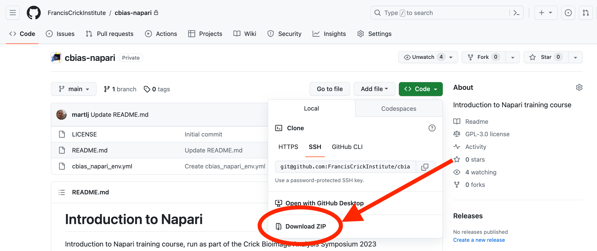

Useful resources
* [Conda cheat sheet](https://docs.conda.io/projects/conda/en/4.6.0/_downloads/52a95608c49671267e40c689e0bc00ca/conda-cheatsheet.pdf)
* https://jni.github.io/using-python-for-science/intro-to-environments.html
* https://focalplane.biologists.com/2022/12/08/managing-scientific-python-environments-using-conda-mamba-and-friends/
* https://biapol.github.io/blog/mara_lampert/getting_started_with_mambaforge_and_python/readme.html

# Introduction to Napari
Introduction to Napari training course, run as part of the Crick Bioimage Analysis Symposium 2023

## Course slides
https://docs.google.com/presentation/d/1XMpOllcfKLbBjMX4CYpHhNL0ldemzSqWyqyY85_n-sk/edit?usp=sharing

## Getting the materials
Download the source from GitHub by clicking on the green "Code" button on [this site](https://github.com/FrancisCrickInstitute/cbias-napari).
 and clicking on "Download ZIP.

Once this has downloaded, you can unzip the directory to your local filesystem. Alternatively, if you're familiar with git or GitHub, you can clone the repository to your local system.

## Using the command line
Assuming you have completed the prerequisites, you should have a terminal application on your computer (either `Terminal` on Mac, or something like `MobaXTerm` on Windows). We'll need to use this for setting up the framework for Napari, for adding new plugins and for launching the application. Note that it _is_ in principle possible to [install as a bundled app](https://napari.org/stable/tutorials/fundamentals/installation.html#install-as-a-bundled-app), but it is strongly recommended to install as a python package at the time of this course (November 2023)

## Creating the conda environment
To install the example conda environment run this in a terminal. If you don't have conda installed, you can obtain it here with miniconda.

`conda env create -f cbias_napari_env.yml`

This will build a conda environment with the plugins used in the demonstration. You only need to do this once, and the environment will be stored on your system ready to be activated whenever you need it. This step can take a while, so be patient!

This conda environment can be activated in a terminal with

`conda activate cbias_napari_env`

and from here you can simply type napari in the command line terminal to launch the viewer (it can take a little while first time).
